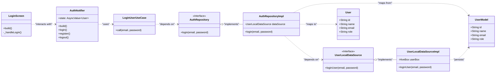

# Application Diagrams (Mermaid)

This file contains the Mermaid code for generating various diagrams that describe the application's architecture and user flows.

---

## 1. Class Diagram

This diagram illustrates the relationship between the main classes in a single feature (e.g., Authentication) following the Clean Architecture principles.

---

## 2. Sequence Diagram: User Login Flow

This diagram shows the sequence of events when a user logs in.

---

## 3. Sequence Diagram: Add New Property Flow

This diagram shows how a landlord adds a new property to the system.

---

## 4. Flowchart: Authentication Redirect Logic

This flowchart visualizes the logic inside GoRouter's `redirect` callback.

